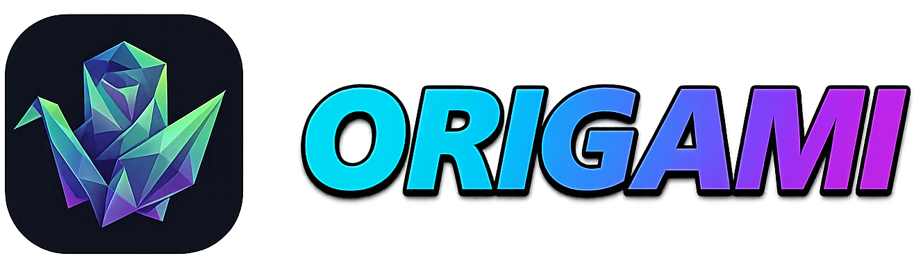

<div align="center">




[](https://github.com/IslandApps/Origami-AI/stargazers) 
[](https://github.com/IslandApps/Origami-AI/issues) 
[](LICENSE) 
[](https://nodejs.org/)

**[Try the Hosted Demo](https://origami.techmitten.com)** | **[Watch the Full Video](https://youtu.be/h1nrUA4TPfs)**


<a href="https://youtu.be/h1nrUA4TPfs" target="_blank" rel="noopener">
	
</a>

</div>

<p>&nbsp;</p>

<p style="text-align:center"><strong>Transform PDF presentations into cinematic narrated videos with AI-generated scripts, browser-based TTS, and local rendering.</strong></p>

## Table of Contents

- [Overview](#overview)
- [Why Origami?](#why-origami)
- [Key Features](#key-features)
	- [PDF Processing](#pdf-processing)
	- [AI-Powered Narration](#ai-powered-narration)
	- [Text-to-Speech](#text-to-speech)
	- [Video Editor](#video-editor)
	- [Analyze Video and Scene Alignment](#analyze-video-and-scene-alignment)
	- [Video Rendering](#video-rendering)
- [Getting Started](#getting-started)
	- [Option A - Hosted (No Setup)](#option-a---hosted-no-setup)
	- [Option B - Run Locally](#option-b---run-locally)
	- [Option C - Docker](#option-c---docker)
	- [Available Scripts](#available-scripts)
- [Requirements](#requirements)
	- [Prerequisites](#prerequisites)
	- [Browser Compatibility](#browser-compatibility)
	- [System Requirements](#system-requirements)
- [How It Works](#how-it-works)
- [Configuration](#configuration)
	- [Settings](#settings)
		- [General](#general)
		- [TTS Model](#tts-model)
		- [WebLLM](#webllm)
		- [API](#api)
		- [AI Prompt](#ai-prompt)
	- [Configure Slides (In-App)](#configure-slides-in-app)
	- [Analyze Video Workflow (In-App)](#analyze-video-workflow-in-app)
	- [WebGPU Setup](#webgpu-setup)
- [Project Backup and Restore](#project-backup-and-restore)
- [Troubleshooting](#troubleshooting)
- [Tech Stack](#tech-stack)
- [Notes](#notes)
- [Support](#support)
- [Credits](#credits)

## Overview

Origami AI is a web application that converts static PDF presentations into polished video content with AI-generated narration, background music, and transitions. Processing happens locally in your browser using WebGPU-accelerated models and FFmpeg.wasm.

## Why Origami?

Traditional video creation from presentations is often a choice between **tedious manual labor** or **expensive AI subscriptions**. Origami AI offers a third way: a fully automated, local-first studio that lives in your browser.

* **🎬 Static to Cinematic:** Don't just show slides; tell a story. Origami automatically extracts context from your PDFs and crafts a narrative script that flows naturally.
* **🔒 Privacy First (Local-Only):** Your data stays on your machine. By leveraging **WebGPU** and **WebLLM**, your scripts and audio are generated locally without ever sending sensitive presentation data to a third-party server.
* **🎙️ The "No-Mic" Solution:** Perfect for creators who prefer not to use their own voice. With integrated **Kokoro.js** TTS, you get high-quality, human-like narration without needing a recording studio.
* **⚙️ Zero Infrastructure:** No complex Python environments or CUDA drivers to wrestle with. If you have a modern browser, you have a professional-grade video editor.
* **💸 Cost Effective:** Avoid "per-minute" AI generation fees. Use your own hardware to run inference and rendering for free.

| Feature | Traditional Editors | Cloud AI Video Tools | Origami AI |
| :--- | :--- | :--- | :--- |
| **Effort** | High (Manual) | Low | **Minimal (Automated)** |
| **Privacy** | Local | Cloud-Based (Risk) | **Local-First** |
| **Cost** | One-time / Free | Monthly Subscription | **Free & Open Source** |
| **Voice** | Your own / Pro Talent | Credits-based TTS | **Unlimited Local TTS** |

---

## Key Features

### PDF Processing
- Drag-and-drop PDF upload
- Automatic text extraction from each slide with PDF.js
- High-resolution image conversion (2x scale)

### AI-Powered Narration
- Local AI processing with MLC-WebLLM
- Remote API support with OpenAI-compatible providers
- Customizable prompts for script behavior

### Text-to-Speech
- Multiple voices (af_heart, af_bella, am_adam, and more)
- Browser TTS via Kokoro.js
- Remote TTS support
- Automatic audio duration calculation for timing

### Video Editor
- Drag-and-drop slide ordering
- Per-slide script editing with highlighting
- Transitions: fade, slide, wipe, blur, zoom
- Background music with volume and auto-ducking
- Per-slide or full-project audio generation

### Analyze Video and Scene Alignment
- Analyze uploaded Slide Media MP4 clips into timestamped scenes using Gemini
- Produces structured scene plans: step number, start timestamp, on-screen action, narration text, and duration
- Adds a full-screen Scene Alignment Editor for timeline-locked scene review and editing
- Supports per-scene TTS generation and full scene-batch TTS generation
- Automatically stretches the effective timeline when narration audio exceeds scene duration
- Stores raw Gemini JSON output for debugging

### Video Rendering
- Browser rendering using FFmpeg.wasm
- 720p and 1080p export
- Real-time progress tracking
- Render cancellation support

## Getting Started

### Option A - Hosted (No Setup)

Visit **[https://origami.techmitten.com](https://origami.techmitten.com)**. No install required.

### Option B - Run Locally

1. Clone the repository:

```bash
git clone https://github.com/IslandApps/Origami-AI.git
cd Origami-AI
```

2. Install dependencies (Node.js >= 20.19.0):

```bash
npm install
```

3. Start development server:

```bash
npm run dev
```

Open **[http://localhost:3000](http://localhost:3000)**.

> The development server is required because it sets `Cross-Origin-Opener-Policy` and `Cross-Origin-Embedder-Policy`, which FFmpeg.wasm and SharedArrayBuffer need. Opening `index.html` directly will not work.

4. Build production assets:

```bash
npm run build
```

5. Preview production build:

```bash
npm run preview
```

### Option C - Docker

Containerized deployment is supported via the included Docker files:

```bash
docker compose up --build
```

App URL: **[http://localhost:3000](http://localhost:3000)**.

### Available Scripts

- `npm run dev` - Start Express + Vite development server with HMR
- `npm run build` - Create production build
- `npm run preview` - Preview production build locally
- `npm run lint` - Run lint checks

## Requirements

### Prerequisites

- Node.js >= 20.19.0
- WebGPU-compatible browser for local AI inference
- Stable internet connection for first-time model downloads
- Docker Desktop or Docker Engine (optional, for container deployment)

### Browser Compatibility

| Browser | Minimum Version |
|---|---|
| Chrome / Chromium | 113+ |
| Microsoft Edge | 113+ |
| Firefox | Nightly (enable `dom.webgpu.enabled`) |
| Safari | 18+ (macOS Sonoma) |

If WebGPU is unavailable, you can still use remote OpenAI-compatible APIs from Settings.

### System Requirements

**Minimum**
- 4-core CPU
- 8GB RAM
- Integrated GPU with WebGPU support

**Recommended**
- 8-core CPU
- 16GB RAM
- Dedicated GPU with WebGPU support
- SSD for faster model/model-cache operations

## How It Works

1. Upload a PDF.
2. Extract text and convert pages to slide images.
3. Generate narration scripts with AI.
4. Generate speech audio from scripts.
5. Edit scripts, voice, timing, transitions, and music.
6. Render final MP4 with FFmpeg.wasm.
7. Download the video.

## Configuration

### Settings

Settings are grouped under **General**, **API**, **TTS Model**, **WebLLM**, and **AI Prompt**.

#### General
- Enable Global Defaults for new uploads
- Intro Fade In and Intro Fade Length (seconds)
- Post-Audio Delay (seconds)
- Audio Normalization toggle
- Recording Countdown toggle
- Default Transition (Fade, Slide, Zoom, None)
- Default Music upload and volume

#### TTS Model
- TTS quantization selection: `q4` or `q8`

#### WebLLM
- Enable/disable local WebLLM
- Select model to load
- Precision filter (f16, f32, all)

#### API
- Configure Base URL and API Key for OpenAI-compatible providers (Gemini, OpenRouter, Ollama, etc.)
- Fetch models from provider

#### AI Prompt
- Customize Script Fix System Prompt

### Configure Slides (In-App)

The slide editor includes five tabs:

- Overview
	- Script edit/focus modes
	- AI Fix Script
	- Copy/Revert, preview, select/delete, reorder, list/grid
- Voice Settings
	- Global voice preview and apply-all
	- Per-slide voice, TTS generation/regeneration, voice recording
	- Per-slide delay and apply-all delay
- Audio Mixing
	- Default music and volume
	- Per-slide music playback, seek, loop, visualizer
	- Video music toggle for video slides
- Batch Tools
	- Generate All Audio, Fix All Scripts, Revert All Scripts, Find & Replace
	- Batch progress/cancel support
- Slide Media
	- Replace slide image/media (PDF/JPG/PNG)
	- Upload MP4/GIF slides (duration auto-detected)
	- Media preview and duration-aware export behavior
	- Analyze Video (silent MP4 only) to generate editable scene narration plans
	- Open Scene Alignment Editor to edit timestamps, durations, and narration per scene
	- Generate TTS per scene or all scenes with timeline stretch recalculation

AI actions require either a configured API provider or a loaded WebLLM model.

### Analyze Video Workflow (In-App)

Use this workflow after uploading a Slide Media video when you want scene-aware narration.

1. Upload a video slide as MP4 in Slide Media.
2. Click **Analyze Video** on that slide.
3. Wait for progress stages (upload, processing, JSON generation, parsing).
4. Open **Edit Scenes** to review in the full-screen Scene Alignment Editor.
5. Adjust scene timestamps (`MM:SS`), durations, and narration text.
6. Generate scene TTS (single scene or all scenes).
7. Render MP4 normally; slide timeline uses the effective stretched duration.

#### Analyze Video Requirements and Limits
- Requires a configured Gemini API key in Settings.
- Video file analysis requires Google Gemini base URL (`https://generativelanguage.googleapis.com/v1beta/openai/`).
- Analyze Video only supports Slide Media silent MP4 uploads.
- GIF/image media is not supported for analysis.
- MP4 files with embedded audio tracks are rejected for this workflow.
- If model output JSON is malformed, Origami automatically retries with a repair prompt.

### WebGPU Setup

If WebGPU is unavailable:

1. Enable hardware acceleration in browser settings.
2. Update browser to latest version.
3. In Firefox Nightly, enable `dom.webgpu.enabled`.

## Project Backup and Restore

Use `.origami` archives from the **Actions** menu to move projects between devices.

- Export Project: Saves slides, media/audio blobs, music settings, and project metadata.
- Import Project: Validates archive and replaces the current project.

Notes:
- Import is strict by archive format version.
- Global defaults in Settings are not changed by project import/export.

## Troubleshooting

- **WebGPU not detected**: Enable hardware acceleration, update GPU drivers, and use a supported browser.
- **Dev server or FFmpeg.wasm errors**: Start via `npm run dev`; do not open `index.html` directly.
- **SharedArrayBuffer / COOP/COEP warnings**: Ensure responses include `Cross-Origin-Opener-Policy: same-origin` and `Cross-Origin-Embedder-Policy: credentialless`.
- **Model download or TTS failures**: Verify internet stability, clear site data, and check browser storage permissions.
- **Out of memory during local inference**: Use smaller/quantized models, close background apps, or switch to remote API.
- **FFmpeg.wasm slow/high memory**: Lower resolution, reduce project size, or run via Docker.
- **Audio/video sync or export failures**: Rebuild with `npm run build`, then retry with `npm run preview`.
- **Analyze Video fails or stays unavailable**: Verify Gemini API key, Google Gemini base URL, and that the slide media is a silent MP4.
- **Analyze Video rejects your MP4 for audio**: Remove the clip audio track, then re-upload and analyze again.
- **Docker issues**: Confirm Docker is installed/running and has enough disk space/permissions.

## Tech Stack

**Frontend**
- React 19.2.0 with TypeScript
- Vite 7.2.4
- Tailwind CSS 4.1.18
- React Router DOM 7.13.0

**Core Libraries**
- `@mlc-ai/web-llm` for local LLM inference
- `@ffmpeg/ffmpeg` and `@ffmpeg/util` for video rendering
- `pdfjs-dist` for PDF rendering and extraction
- `kokoro-js` for text-to-speech
- `@dnd-kit` for drag-and-drop UI

**Backend (Dev Server)**
- Express.js 5.2.1
- TypeScript

## Notes

- AI workflows can run locally in-browser; model downloads are cached after first use.
- First-time setup can take several minutes based on network speed.
- Rendering performance depends on available CPU/GPU/memory.

## Support

Report issues at: https://github.com/IslandApps/Origami-AI/issues

When reporting, include:
- Browser and version
- OS
- Node version (`node -v`)
- Reproduction steps
- Relevant console logs

## Credits

- WebLLM: https://github.com/mlc-ai/web-llm
- Kokoro.js: https://github.com/Kokoro-js
- ffmpeg.wasm: https://github.com/ffmpegwasm/ffmpeg.wasm
