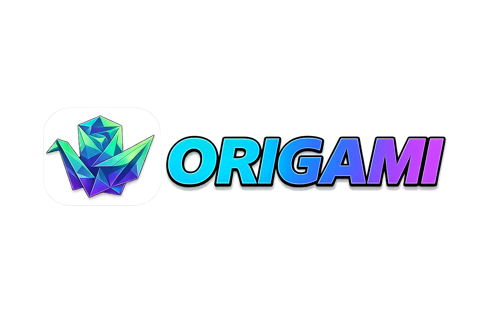

<div align="center" style="display:flex;flex-direction:column;align-items:center;gap:12px;margin-bottom:20px;">
  
  <div style="display:inline-flex;flex-wrap:wrap;gap:8px;justify-content:center;align-items:center;">
    <a href="https://github.com/IslandApps/Origami-AI/stargazers"></a>
    <a href="https://github.com/IslandApps/Origami-AI/issues"></a>
    <a href="LICENSE"></a>
    <a href="https://nodejs.org/"></a>
  </div>
</div>

<p style="text-align:center;margin-top:6px;"><strong>Transform PDF presentations into cinematic, narrated videos — AI-generated scripts, local WebLLM TTS, scene-aware video analysis and bug reporting, Chrome-extension-assisted recording, and in-browser FFmpeg rendering.</strong></p>

## Table of Contents

- [What It Does](#what-it-does)
- [Why Origami?](#why-origami)
- [Key Features](#key-features)
- [Getting Started](#getting-started)
- [Requirements](#requirements)
- [How It Works](#how-it-works)
- [Configuration](#configuration)
- [Keyboard Shortcuts](#keyboard-shortcuts)
- [Development](#development)
- [Troubleshooting](#troubleshooting)
- [Contributing](#contributing)
- [Support](#support)
- [Credits](#credits)

## What It Does

**Origami AI** converts static PDF presentations into polished, cinematic videos and richer interactive outputs — primarily locally, with optional cloud-assisted analysis when needed. Key capabilities include:
- 🎬 **AI-generated narration scripts** — local WebLLM or remote Gemini/OpenAI APIs
- 🎙️ **High-quality in-browser TTS** — Kokoro.js with multiple voices
- 🔍 **Scene-aware video analysis & issue reporting** — auto-generate breakdowns and bug reports from MP4s
- 💬 **AI Assistant Chat & WebLLM** — conversational assistance with cloud fallbacks
- 🔒 **Secure server-side API proxying** - `LLM_API_KEY` kept secret from client bundles with automatic proxying for Gemini and OpenAI-compatible APIs
- ⚡ **WebGPU-accelerated inference** - faster local model execution
- 📹 **In-browser FFmpeg rendering** - professional MP4 exports (720p/1080p)
- 🎵 **Background music & audio mixing** — auto-ducking and smooth transitions
- 🎯 **Smart screen recording** — auto-zoom with Chrome-extension DOM telemetry

Simply upload a PDF, generate narration or analyze a recorded clip, customize timing and transitions, and export a broadcast-quality MP4 — all from your browser with optional secure cloud features.

## Why Origami?

**Origami is the art of folding paper into new shapes.** Similarly, Origami AI transforms flat slides into cinematic videos by adding AI narration, music, and professional camera effects.

| Feature | Traditional Video Editors | Cloud AI Services | Origami AI |
|---------|---------------------------|-------------------|-----------|
| **Learning Curve** | Steep (complex UI) | Easy (simplified) | **Minimal (automated)** |
| **Privacy** | Local ✓ | Cloud-based ✗ | **Local-first ✓** |
| **Cost** | One-time or free | Monthly credits | **Free & open source** |
| **Voice** | Your own / hire talent | Pay per minute | **Unlimited local TTS** |
| **Time to Video** | Hours | Minutes | **~10-30 min** |

### Why Choose Local Processing?

- **🔒 Privacy:** Your presentation data never leaves your computer
- **💰 Cost-effective:** No subscription fees or per-minute charges
- **⚡ Fast:** After models load, rendering is typically 5-20 min depending on video length
- **🎯 Complete control:** Edit scripts, timing, and effects at every step
- **📡 Works offline:** After initial model downloads, all processing is local

## Key Features

### Core Capabilities

- **PDF Processing** - Drag-and-drop upload with automatic text extraction and high-resolution image conversion (PDF.js)
- **AI-Powered Scripts** - Generate narrative scripts locally with WebLLM or use remote OpenAI-compatible APIs
- **Text-to-Speech** - Kokoro.js for high-quality local TTS with multiple voices (af_heart, af_bella, am_adam, etc.)
- **Video Editing** - Drag-and-drop slide reordering, per-slide script editing, transitions, and background music
- **Smart Rendering** - FFmpeg.wasm video composition with 720p/1080p export and real-time progress tracking

### Advanced Features

- **Screen Recording** - Record browser tabs or desktop with auto-zoom during idle periods (2+ sec inactivity)
- **Chrome Extension** - Capture cursor position and DOM interactions for precise follow effects
- **Scene Analysis** - Upload MP4 videos and auto-generate timestamped scene breakdowns with Gemini API
- **AI Assistant Chat** - Local chatbot with 9+ WebLLM models and image/video analysis support
- **Issue Reporter** - Capture bugs, get AI-powered analysis with debugging suggestions
- **Project Backup** - Export and import `.origami` archives to move projects between devices

## Getting Started

### Quick Start (Local Development)

```bash
# Clone the repository
git clone https://github.com/IslandApps/Origami-AI.git
cd Origami-AI

# Install dependencies (requires Node.js >= 20.19.0)
npm install

# Start development server
npm run dev
```

Open [http://localhost:3000](http://localhost:3000) in your browser. The development server sets required headers for SharedArrayBuffer and FFmpeg.wasm to function.

> **Important:** Do not open `index.html` directly. The dev server with proper CORS/COOP/COEP headers is required.

### Available Commands

| Command | Purpose |
|---------|---------|
| `npm run dev` | Start Express + Vite dev server with HMR |
| `npm run build` | Build production assets for deployment |
| `npm run preview` | Preview production build locally |
| `npm run lint` | Check code for linting issues |

### Docker Deployment

For containerized deployment with proper header configuration:

```bash
docker compose up --build
```

App will be available at [http://localhost:3000](http://localhost:3000).

### Chrome Extension (Optional)

For enhanced browser tab interaction tracking during screen recording:

1. Open `chrome://extensions` in Chrome/Edge
2. Enable **Developer mode** (top-right toggle)
3. Click **Load unpacked** and select the `chrome-extension/` folder
4. See [chrome-extension/README.md](chrome-extension/README.md) for full setup instructions

The extension is optional—Origami AI has fallback local interaction tracking if the extension is unavailable.

## Requirements

### Prerequisites

- **Node.js** >= 20.19.0
- **WebGPU-compatible browser** (see browser support below)
- **Stable internet** for initial model downloads (~1-5GB depending on models used)
- **50GB+ free storage** for browser cache and model artifacts

### Browser Support

| Browser | Min. Version | Notes |
|---------|--------------|-------|
| Chrome/Chromium | 113+ | Chrome Extension available for enhanced recording |
| Edge | 113+ | Chrome Extension available for enhanced recording |
| Firefox | Nightly | Enable `dom.webgpu.enabled` in `about:config` |
| Safari | 18+ (macOS Sonoma) | Desktop recording supported |

**WebGPU is required for:** Local AI narration generation, AI Assistant Chat, and screen recording with auto-zoom effects. If unavailable, you can use remote OpenAI-compatible APIs instead.

### System Specifications

**Minimum**
- 4-core CPU, 8GB RAM, integrated GPU
- ~1-2 hours for initial model downloads and video rendering

**Recommended**
- 8-core CPU, 16GB RAM, dedicated GPU with F16 support
- NVMe SSD for faster model operations
- Hardware video encoding for screen recording workflows

**AI Assistant Chat Models** (optional)
- Gemma 2 2B: 1.4GB download, ~2GB VRAM
- Llama 3.2 1B: 800MB download, ~1.5GB VRAM
- Llama 3.2 3B: 1.7GB download, ~2.5GB VRAM
- Phi 3.5 Vision: 3.9GB download, ~4GB VRAM (includes image/video analysis)

## How It Works

### Primary Workflow: PDF → Video

1. **Upload** a PDF presentation
2. **Extract** slide images and text automatically
3. **Generate** AI narration scripts (local WebLLM or remote API)
4. **Synthesize** speech audio from scripts using Kokoro.js TTS
5. **Edit** scripts, timing, transitions, and background music in the visual editor
6. **Render** final MP4 video with FFmpeg.wasm (720p or 1080p)
7. **Download** the finished video

Typical timeline: 10-30 minutes depending on slide count and GPU performance.

### Alternative Input: Screen Recording

- Record browser tabs or desktop with precise interaction tracking
- Auto-zoom applied during idle periods (>2 seconds) for cinematic effect
- Captured interactions feed into video editor for synchronization
- Combine with PDF slides or use as standalone video content

### Additional Tools

- **Scene Analysis** - Upload MP4 videos to auto-generate timestamped scene breakdowns
- **AI Assistant Chat** - Ask questions, attach images/videos for analysis (local or cloud models)
- **Issue Reporter** - Record and analyze bugs with AI-powered debugging suggestions

## Configuration

### Settings Overview

Access settings via the **⚙️ Settings** button in the app header. Key configuration options:

| Setting | Purpose |
|---------|---------|
| **General** | Intro fade timing, post-audio delay, default transition, recording options |
| **TTS Model** | Select Kokoro.js quantization (`q4` for quality or `q8` for fast) |
| **WebLLM** | Enable/disable local AI, select model, filter by precision (f16/f32) |
| **API** | Configure remote OpenAI-compatible providers (Gemini, OpenRouter, Ollama) |
| **AI Prompt** | Customize narration script generation behavior |

### API Key Configuration

Origami AI supports both **local inference** (WebLLM, no API key needed) and **cloud-based APIs** (Gemini, OpenAI-compatible providers) for AI narration generation, video analysis, and bug reporting.

#### Development Setup

For local development, you can use browser-exposed API keys:

1. **Get a Gemini API Key** (free tier available):
   - Go to [Google AI Studio](https://aistudio.google.com/app/apikey)
   - Click "Get API key"
   - Copy the generated key

2. **Configure for Development**:
   - Create a `.env` file in the project root (copy from `.env.example`)
   - Set `VITE_LLM_API_KEY` to your Gemini API key:
     ```env
     VITE_LLM_API_KEY=your_api_key_here
     VITE_LLM_BASE_URL=https://generativelanguage.googleapis.com/v1beta/openai/
     VITE_LLM_MODEL=gemini-flash-latest
     ```
   - Start the dev server: `npm run dev`
   - The `VITE_` prefix tells Vite to expose the key to the client bundle (safe only in dev)

3. **In Settings** (app ⚙️ button):
   - Go to **API** tab
   - Verify **Base URL** and **Model** match your configuration
   - The app will use your API key for AI operations (narration, analysis, chat)

#### Production Setup (Recommended)

To prevent exposing API keys in production builds, use server-side proxy endpoints:

1. **Configure Server-Only Key**:
   - Set `LLM_API_KEY` environment variable on your production server/host:
     ```bash
     export LLM_API_KEY=your_api_key_here
     ```
   - **Do NOT set `VITE_LLM_API_KEY`** in production (it would be baked into the client bundle)

2. **Client Configuration**:
   - In production builds, the client will have no API key
   - The app automatically detects this and proxies requests to the server
   - Server endpoints handle the API calls securely:
     - `POST /api/llm/chat` - Chat/completion requests
     - `POST /api/llm/analyze-video` - Video analysis with file upload
     - `POST /api/llm/analyze-issue` - Issue recording analysis

3. **Deploy**:
   - Build: `npm run build`
   - Deploy the `dist/` folder to your host
   - Ensure `LLM_API_KEY` is set in your host's environment (not in code)
   - Run: `npm run preview` or use your host's production runner

#### Environment Variables Reference

| Variable | Context | Purpose |
|----------|---------|---------|
| `VITE_LLM_API_KEY` | Client (dev only) | Exposes API key to browser for development; **NEVER set in production** |
| `LLM_API_KEY` | Server (prod) | Server-side API key for proxy endpoints; kept secret from client |
| `VITE_LLM_BASE_URL` | Client | Endpoint URL (e.g., `https://generativelanguage.googleapis.com/v1beta/openai/`) |
| `VITE_LLM_MODEL` | Client | Model identifier (e.g., `gemini-2.5-flash-lite`) |
| `CLIENT_URL` | Server CORS | Comma-separated list of allowed client origins (e.g., `http://localhost:3000`) |
| `PORT` | Server | Port to run the server on (default: 3000) |
| `NODE_ENV` | Runtime | Set to `production` for production builds |

#### Security Best Practices

- ✅ **Use local WebLLM** when possible (no API key needed)
- ✅ **Server-side keys only** in production (use `LLM_API_KEY` without `VITE_` prefix)
- ✅ **Rotate keys** if accidentally exposed in source control
- ✅ **Use environment variables** for secrets (never hardcode in source)
- ❌ **Never commit `.env`** to source control (use `.env.example` as template)
- ❌ **Don't use `VITE_LLM_API_KEY`** in production builds
- ❌ **Don't expose `LLM_API_KEY`** through client-side code

### Video Editing

Once a PDF is loaded, the **Slide Editor** provides five tabs:

- **Overview** - Script editing, AI fix, copy/revert, reorder slides
- **Voice Settings** - Per-slide voice selection, TTS generation, voice recording
- **Audio Mixing** - Background music with per-slide control and visualizer
- **Batch Tools** - Generate all audio, fix scripts, find & replace across slides
- **Slide Media** - Replace slide images/media, upload MP4 for analysis

### Advanced Workflows

For additional setup details:
- **Scene Analysis & Alignment** - Upload MP4 videos to auto-generate timestamped scene breakdowns with Gemini API
- **Chrome Extension Setup** - See [chrome-extension/README.md](chrome-extension/README.md) for enhanced interaction tracking
- **AI Assistant Chat** - Configure local WebLLM models or remote API providers in Settings
- **Issue Reporter** - Requires Gemini API key configured in Settings

### Project Backup

Export and import `.origami` archives to move projects between devices:
- **Export** saves slides, media, audio, and all settings
- **Import** validates archive format before restoring

> Global settings are not affected by project import/export.

## Keyboard Shortcuts

| Shortcut | Action |
|----------|--------|
| `Ctrl` / `Cmd` + `S` | Save project |
| `Ctrl` / `Cmd` + `Z` | Undo |
| `Ctrl` / `Cmd` + `Shift` + `Z` | Redo |
| `Ctrl` / `Cmd` + `E` | Export project |
| `Ctrl` / `Cmd` + `I` | Import project |
| `Space` | Play/pause preview |
| `Left Arrow` | Previous slide |
| `Right Arrow` | Next slide |

## Development

### Project Structure

```
src/
├── components/      # React UI components
├── pages/          # Route components (AssistantPage, etc.)
├── services/       # Core business logic
│   ├── aiService.ts
│   ├── webLlmService.ts
│   ├── ttsService.ts
│   ├── pdfService.ts
│   └── BrowserVideoRenderer.ts
├── hooks/          # Custom React hooks
├── context/        # React context providers
└── utils/          # Utilities and helpers
```

### Architecture Highlights

- **Service Layer Pattern** - Modular services for AI, TTS, PDF, and video rendering
- **React Hooks** - State management with useState/useEffect
- **IndexedDB** - Persistent slide/app state with automatic blob URL conversion
- **Event-Driven** - Custom events for async operations (ttsEvents, videoEvents, webLlmEvents)
- **Vite** - Fast module bundling with manual chunks for large libraries

### Important Notes for Contributors

- WebGPU memory buffer patch is disabled to prevent performance degradation
- Vision features were removed in v1.0 - do not restore
- Always test production builds before submitting changes: `npm run build && npm run preview`

See [CONTRIBUTING.md](CONTRIBUTING.md) for development guidelines and contribution process.

## Troubleshooting

For comprehensive troubleshooting guidance including WebGPU issues, performance optimization, and error recovery, see [TROUBLESHOOTING.md](TROUBLESHOOTING.md).

**Quick Reference:**
- **WebGPU not detected** - Enable hardware acceleration, update GPU drivers, use supported browser
- **Dev server/FFmpeg errors** - Run via `npm run dev`; do not open `index.html` directly
- **Model download failures** - Verify internet stability, clear browser cache, check storage permissions
- **Out of memory** - Use smaller models, close background apps, or reduce video resolution
- **COOP/COEP warnings** - Ensure dev server is running with proper headers

## Tech Stack

**Frontend**
- React 19.2.0 with TypeScript
- Vite 7.2.4
- Tailwind CSS 4.1.18
- React Router DOM 7.13.0

**Core Libraries**
- `@mlc-ai/web-llm` for local LLM inference (AI narration scripts, AI Assistant Chat)
- `@ffmpeg/ffmpeg` and `@ffmpeg/util` for video rendering and screen recording composition
- `pdfjs-dist` for PDF rendering and extraction
- `kokoro-js` for text-to-speech
- `@dnd-kit` for drag-and-drop UI

**Browser Extensions**
- Chrome Extension (JavaScript) - MessagePort communication for DOM-level interaction telemetry
- Background service worker for recording state management
- Content script injection for cursor and event capture

**Backend (Dev Server)**
- Express.js 5.2.1
- TypeScript

**AI & Analysis**
- WebGPU for GPU acceleration of all local models
- Google Gemini API for video analysis and bug report generation (optional, requires API key)

## Notes

### Downloadable Chrome extension ZIP (In-App)

- You can download a packaged ZIP of the Chrome/Edge extension directly from the app UI:
   - **Header Actions menu** → "Download Chrome Extension"
   - **Slide Editor** → Tools → *Slide Media* → "Download Extension" card → "Download ZIP"
- The ZIP included in source is located at `src/assets/extension/chrome-extension.zip` and the production build emits it to `dist/assets/` with a hashed filename (e.g. `chrome-extension-<hash>.zip`).
- Install tip: download and unzip the archive, then open `chrome://extensions`, enable **Developer mode**, click **Load unpacked**, and select the unzipped folder.

**Developer note:** the repo imports the ZIP as a Vite asset URL. Use the `?url` suffix when importing so the file is treated as a static asset, e.g.:

```ts
import chromeExtensionZipUrl from '../assets/extension/chrome-extension.zip?url';
```

This avoids Rollup parsing binary content errors during production builds.

- AI workflows can run locally in-browser; model downloads are cached after first use.
- First-time setup can take several minutes based on network speed and model size.
- Rendering and analysis performance depend on available CPU/GPU/memory.
- Screen recording with auto zoom works on all major browsers; Chrome extension provides enhanced DOM telemetry for browser tabs.
- AI Assistant Chat requires WebGPU; fall back to Gemini API for AI narration generation if unavailable.
- Issue Reporter and Video Analysis workflows require configured Gemini API key for AI processing.
- All user data stays local in the browser unless explicitly using cloud APIs (Gemini, OpenAI-compatible providers).

## Support

### Getting Help

- **Issues & Bugs**: Report at [GitHub Issues](https://github.com/IslandApps/Origami-AI/issues)
- **Troubleshooting**: See [TROUBLESHOOTING.md](TROUBLESHOOTING.md) for common issues and error recovery

### When Reporting Issues

Include:
- Browser name and version
- Operating system
- Node.js version (`node -v`)
- Steps to reproduce the issue
- Relevant console logs or error messages

## Contributing

We welcome contributions from the community! See [CONTRIBUTING.md](CONTRIBUTING.md) for:
- Code contribution guidelines
- Development setup
- Pull request process
- Code style standards

### Project Maintainers

- **TechMitten LLC** - Project creator and primary maintainer

## Credits

**Core Technologies**
- [WebLLM](https://github.com/mlc-ai/web-llm) - Local LLM inference in browsers
- [Kokoro.js](https://github.com/Kokoro-js) - High-quality browser TTS
- [FFmpeg.wasm](https://github.com/ffmpegwasm/ffmpeg.wasm) - Video processing in browsers
- [PDF.js](https://mozilla.github.io/pdf.js/) - PDF rendering and text extraction

**UI/UX Libraries**
- [React](https://react.dev) - UI framework
- [Tailwind CSS](https://tailwindcss.com) - Styling
- [Lucide React](https://lucide.dev) - Icons
- [dnd-kit](https://docs.dndkit.com) - Drag-and-drop functionality

**License**

This project is licensed under the [MIT License](LICENSE).

---

<div align="center">

**[⬆ back to top](#table-of-contents)**

Made with ❤️ by the Origami AI community

</div